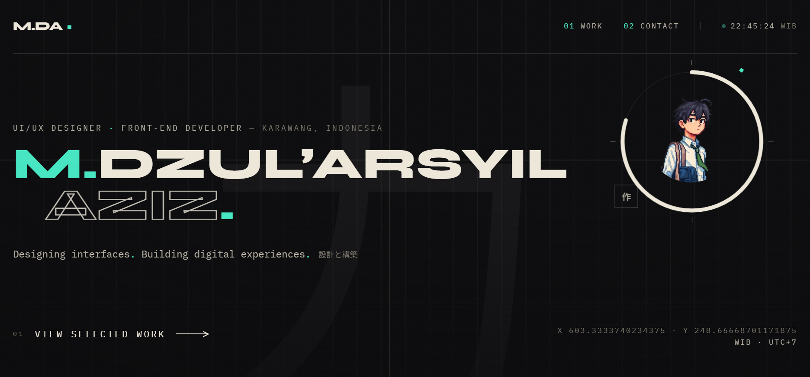

<div align="center">

# M. Dzul'Arsyil Aziz

### UI/UX Designer · Front-end Developer · Creative Technologist

Designing interfaces. Building digital experiences. 設計と構築.

<br />

[](https://dzularsyil.github.io/Portofoliov2/)
[](https://github.com/DzulArsyil)
[](https://www.linkedin.com/in/mdzularsyilaziz/)

</div>

---

## ✦ Portfolio Preview

<div align="center">

> A personal portfolio built around the intersection of **visual design, interaction, and code**.

<br />

<!-- Replace this image with your final portfolio screenshot when ready. -->


</div>

<br />

## 01 — About

**Portofoliov2** is my personal portfolio website and a living playground for exploring the relationship between **UI/UX design and front-end development**.

Rather than treating the portfolio as a simple collection of projects, the experience is designed to communicate how I think, design, and build digital products.

The visual direction combines a **minimal editorial layout**, Japanese-inspired visual language, typography, negative space, and subtle interactive motion.

---

## 02 — Design Direction

The interface follows a simple idea:

> **Less noise. More intention.**

The visual system explores:

- **Japanese-inspired minimalism** — restraint, rhythm, and negative space.
- **Editorial typography** — strong hierarchy and expressive type treatment.
- **Interactive depth** — subtle cursor-driven movement and layered elements.
- **Motion with purpose** — animation is used to support perception rather than distract.
- **Responsive thinking** — the experience is designed to adapt across screen sizes.

The hero experience uses layered depth, an **Enso-inspired visual object**, Japanese typography, live cursor coordinates, and responsive type scaling to create a distinct first impression.

---

## 03 — Featured Work

The portfolio is built to showcase selected work across **product design, UI/UX, visual design, and development**.

| Project | Focus |
| --- | --- |
| **Founit** | Product / UI/UX Design |
| **SkyExplore** | Travel / UI/UX Design |
| **LifeSync** | Digital Product / UI/UX |
| **IqraMate** | Educational Product Design |
| **SentraWarga** | Digital Product / Development |
| **Flowance** | Finance / Web Application |

> More detailed project stories and explorations are available through the live portfolio.

---

## 04 — Toolkit

### Design

`Figma` · `Adobe Illustrator` · `Canva` · `Affinity`

### Front-end

`React` · `TypeScript` · `JavaScript` · `HTML` · `CSS`

### Development

`PHP` · `Laravel` · `Blade` · `Tailwind CSS` · `Bootstrap`

### Data & Tools

`MySQL` · `MariaDB` · `Git` · `GitHub` · `Vite`

### Currently Exploring

`Interaction Design` · `Creative Development` · `Advanced Front-end` · `Product Design`

---

## 05 — Experience

My experience combines **creative problem solving, software development, and real-world work environments**.

I have worked with production and quality-assurance documentation, while continuing to develop skills in digital design and software development.

This combination influences how I approach digital products: **visual quality matters, but so do structure, usability, consistency, and real-world constraints.**

---

## 06 — Technology Behind This Portfolio

This portfolio is built with a modern front-end stack focused on performance, interaction, and maintainability.

- **React 18** — component-based UI architecture
- **TypeScript** — safer and more maintainable code
- **Vite** — fast development and production builds
- **Tailwind CSS** — utility-first styling
- **Framer Motion** — interface motion and transitions
- **React Router** — client-side navigation
- **Lucide React** — interface iconography

The project also includes supporting libraries for interaction, data visualization, and application functionality.

---

## 07 — Interaction & Accessibility

The interface is intentionally interactive, but interaction should never become a barrier.

The portfolio accounts for:

- Responsive layouts across desktop, tablet, and mobile.
- Reduced-motion preferences.
- Fine-pointer detection for cursor-based interactions.
- Keyboard-friendly interactive elements.
- Semantic HTML and accessible labels where appropriate.
- Fluid typography that adapts to viewport dimensions.

---

## 08 — Local Development

Clone the repository and install dependencies:

```bash
git clone https://github.com/DzulArsyil/Portofoliov2.git
cd Portofoliov2
npm install
```

Start the development server:

```bash
npm run dev
```

Create a production build:

```bash
npm run build
```

Run TypeScript checking:

```bash
npm run typecheck
```

---

## 09 — Philosophy

<div align="center">

### Design × Technology × Storytelling

**Good design is not decoration.**

It is the structure that makes an experience understandable,
memorable, and meaningful.

</div>

---

## 10 — Connect

<div align="center">

If you'd like to explore my work, collaborate, or simply say hello:

<br /><br />

[🌐 Portfolio](https://dzularsyil.github.io/Portofoliov2/) · [💼 LinkedIn](https://www.linkedin.com/in/mdzularsyilaziz/) · [📸 Instagram](https://www.instagram.com/designwithdzul/) · [⌘ GitHub](https://github.com/DzulArsyil)

<br /><br />

**Made with curiosity, design, and code.**

</div>

---

<div align="center">

<sub>© M. Dzul'Arsyil Aziz · Portofoliov2</sub>

</div>
